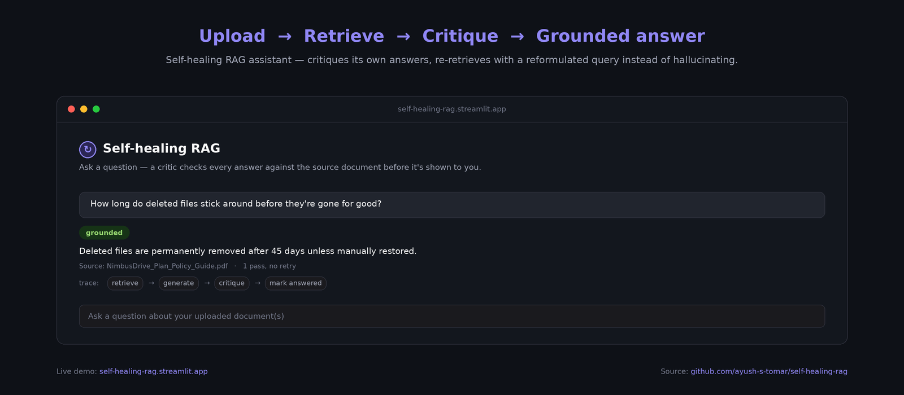
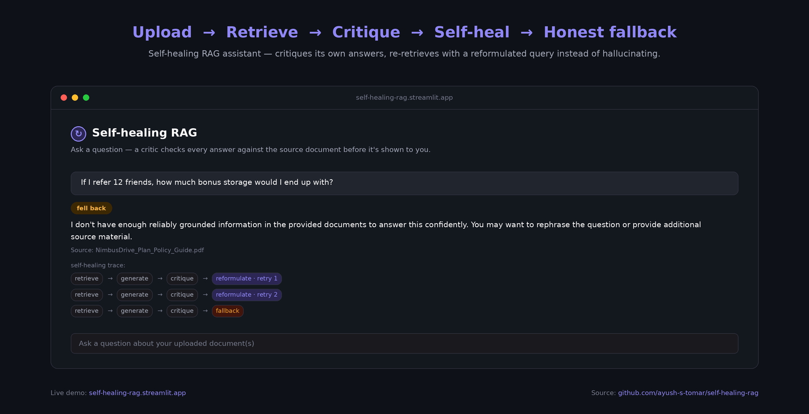
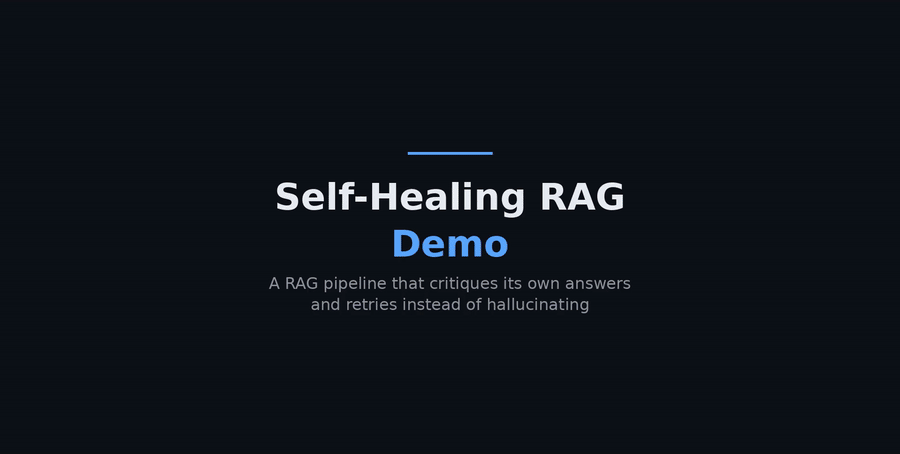
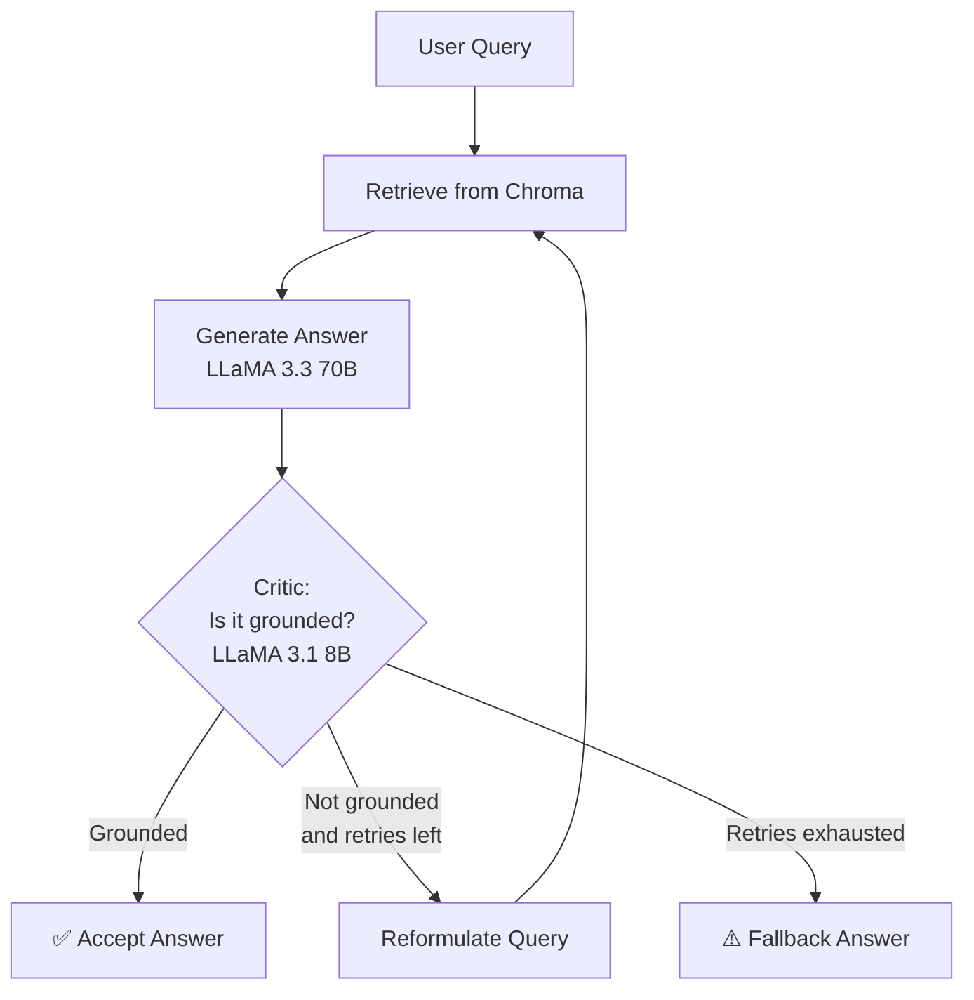

<div align="center">

# 🔁 Self-Healing RAG

**A Retrieval-Augmented Generation pipeline that critiques its own answers — and retries instead of hallucinating.**

[](https://www.python.org/)
[](https://rag-critic-loop.streamlit.app/)
[](https://www.langchain.com/langgraph)
[](https://groq.com/)
[](LICENSE)
[](https://github.com/ayush-s-tomar/self-healing-rag/actions/workflows/ci.yml)
[](https://github.com/ayush-s-tomar/self-healing-rag/issues)
[](https://github.com/ayush-s-tomar/self-healing-rag/commits/main)

[**🚀 Live Demo**](https://rag-critic-loop.streamlit.app/) · [Report Bug](https://github.com/ayush-s-tomar/self-healing-rag/issues) · [Request Feature](https://github.com/ayush-s-tomar/self-healing-rag/issues)

</div>

---

## 📖 Overview

Most RAG pipelines retrieve documents, stuff them into a prompt, and generate an answer — full stop. If the retrieved context is thin or the generator drifts, the result is a confident hallucination with no safety net.

**Self-Healing RAG** adds a closed loop: a **critic** model checks whether the generated answer is actually grounded in the retrieved documents. If it isn't, the pipeline **reformulates the query and retries** — up to a configurable retry limit — before falling back gracefully. You can watch this entire decision process happen live in the **"Self-healing trace"** panel of the app.

## 📸 Screenshots

<p align="center">
  
  
</p>

## 🎥 Demo

<p align="center">
  
</p>

**Full walkthrough video:** https://github.com/user-attachments/assets/64c62ba5-f80b-48aa-86fc-e30ab216332d

## ✨ Features

- 🔄 **Cyclical self-correction loop** — built as a `StateGraph` in [LangGraph](https://www.langchain.com/langgraph), not a linear chain
- 🧠 **Two-model split** — a fast LLaMA 3.1 8B critic judges groundedness while LLaMA 3.3 70B (via [Groq](https://groq.com/)) handles generation
- 📚 **PDF ingestion** — upload any PDF and query it directly from the sidebar
- 🔍 **Transparent reasoning** — expand the self-healing trace to see every retrieval, critique, and retry step in real time
- 🛡️ **Graceful fallback** — after the retry budget is exhausted, the app returns an honest fallback answer instead of guessing
- 🗄️ **Vector storage** via [Chroma](https://www.trychroma.com/)

## 🏗️ Architecture



The loop is implemented as a cyclical LangGraph `StateGraph`: `retrieve → generate → critique → route`, where `route_after_critique` decides whether to `accept`, `retry`, or `fallback` based on the critic's groundedness verdict and the current retry count.

## 🚀 Getting Started

### Prerequisites

- Python 3.10+
- A [Groq API key](https://console.groq.com/keys)

### Installation

```bash
# Clone the repo
git clone https://github.com/ayush-s-tomar/self-healing-rag.git
cd self-healing-rag/streamlit_app

# Install dependencies
pip install -r requirements.txt

# Set your Groq API key
export GROQ_API_KEY="your-key-here"   # on Windows: setx GROQ_API_KEY "your-key-here"

# Run the app
streamlit run app.py
```

The app will be available at `http://localhost:8501`.

> **Note:** On free CPU hardware (e.g. Hugging Face Spaces), PDF ingestion and the first query may take 20–30 seconds while models warm up.

## 🧰 Project Structure

```
self-healing-rag/
├── streamlit_app/
│   ├── app.py            # Streamlit UI entry point
│   ├── graph.py           # LangGraph StateGraph definition
│   ├── nodes.py            # Node functions: generate, critique, fallback, routing
│   ├── retrieval.py        # Chroma-backed retrieval logic
│   └── requirements.txt
├── assets/                 # Screenshots and media used in this README
├── .github/workflows/ci.yml
├── LICENSE
└── README.md
```

## 🛠️ Tech Stack

| Layer | Tool |
|---|---|
| Orchestration | [LangGraph](https://www.langchain.com/langgraph) |
| LLM inference | [Groq](https://groq.com/) (LLaMA 3.1 8B / 3.3 70B) |
| Vector store | [Chroma](https://www.trychroma.com/) |
| UI | [Streamlit](https://streamlit.io/) |
| Deployment | Hugging Face Spaces (Docker) |

## 🤝 Contributing

Contributions, issues, and feature requests are welcome! Feel free to check the [issues page](https://github.com/ayush-s-tomar/self-healing-rag/issues).

1. Fork the project
2. Create your feature branch (`git checkout -b feature/amazing-feature`)
3. Commit your changes (`git commit -m 'Add some amazing feature'`)
4. Push to the branch (`git push origin feature/amazing-feature`)
5. Open a Pull Request

## 📄 License

Distributed under the MIT License. See [`LICENSE`](LICENSE) for more information.

## 🙋 Author

**Ayush Singh Tomar**
[GitHub](https://github.com/ayush-s-tomar)

---

<div align="center">
<sub>If this project helped you, consider giving it a ⭐!</sub>
</div>